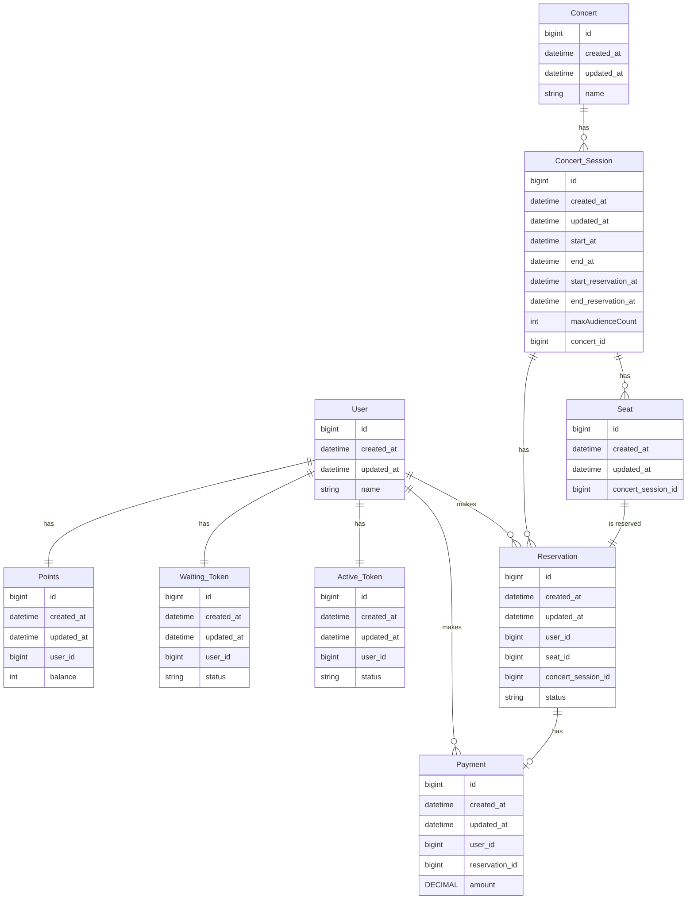

# 1. 콘서트 예약 서비스 ERD 설계 개요

본 문서는 콘서트 예약 서비스의 ERD(Entity Relationship Diagram) 설계에 대한 개요와 세부 사항을 설명합니다. 설계는 유저, 포인트, 예약, 콘서트 및 관련된 주요 엔터티 간의 관계를 명확히 정의하고, 시스템에서 각 엔터티가 수행하는 역할을 체계적으로 설명합니다.

# 1-1. ERD

# 2. ERD 설명

### 2-1. 엔터티 설명

#### 1. **User**

- **속성**:
  - `id`: 유저 고유 식별자
  - `created_at`, `updated_at`: 생성 및 수정 시간
  - `name`: 유저 이름

#### 2. **Points**

- **속성**:
  - `id`: 포인트 고유 식별자
  - `user_id`: 포인트가 소속된 유저 ID
  - `balance`: 현재 포인트 잔액
- **기능**:
  - 유저의 포인트 잔액 관리

#### 3. **Waiting_Token**

- **속성**:
  - `id`: 대기 토큰 고유 식별자
  - `user_id`: 토큰 소유 유저 ID
  - `status`: 대기 토큰 상태
- **기능**:
  - 대기열에서 유저의 순서를 관리

#### 4. **Active_Token**

- **속성**:
  - `id`: 활성 토큰 고유 식별자
  - `user_id`: 토큰 소유 유저 ID
  - `status`: 활성 토큰 상태
- **기능**:
  - 활성화된 유저의 예약 권한 관리

#### 5. **Payment**

- **속성**:
  - `id`: 결제 고유 식별자
  - `user_id`: 결제를 수행한 유저 ID
  - `reservation_id`: 결제와 연결된 예약 ID
  - `amount`: 결제 금액
- **기능**:
  - 예약과 연결된 결제 기록 관리

#### 6. **Concert**

- **속성**:
  - `id`: 콘서트 고유 식별자
  - `name`: 콘서트 이름
- **기능**:
  - 콘서트 세션과 예약 관리

#### 7. **Concert_Session**

- **속성**:
  - `id`: 콘서트 세션 고유 식별자
  - `start_at`, `end_at`: 세션 시작 및 종료 시간
  - `start_reservation_at`, `end_reservation_at`: 예약 가능 시작 및 종료 시간
  - `maxAudienceCount`: 최대 관객 수
  - `concert_id`: 연결된 콘서트 ID
- **기능**:
  - 세션 단위로 예약 및 좌석 관리

#### 8. **Seat**

- **속성**:
  - `id`: 좌석 고유 식별자
  - `concert_session_id`: 연결된 콘서트 세션 ID
- **기능**:
  - 각 세션 내 좌석의 상태 및 예약 정보 관리

#### 9. **Reservation**

- **속성**:
  - `id`: 예약 고유 식별자
  - `user_id`: 예약을 수행한 유저 ID
  - `seat_id`: 예약된 좌석 ID
  - `concert_session_id`: 연결된 콘서트 세션 ID
  - `status`: 예약 상태
- **기능**:
  - 유저와 콘서트 세션 간 예약 정보 및 상태 관리

---

### 2-2. 관계 설명

1. **유저와 포인트 (1:1)**
   - 각 유저는 하나의 포인트 계정을 가집니다.
2. **유저와 대기 토큰 (1:1)**
   - 각 유저는 하나의 대기 토큰을 가질 수 있습니다.
3. **유저와 활성 토큰 (1:1)**
   - 각 유저는 하나의 활성 토큰을 가질 수 있습니다.
4. **유저와 결제 (1:N)**
   - 각 유저는 다수의 결제 기록을 남길 수 있습니다.
5. **유저와 예약 (1:N)**
   - 각 유저는 다수의 예약을 할 수 있습니다.
6. **콘서트와 콘서트 세션 (1:N)**
   - 하나의 콘서트는 여러 세션으로 구성될 수 있습니다.
7. **콘서트 세션과 좌석 (1:N)**
   - 하나의 세션은 다수의 좌석을 가질 수 있습니다.
8. **콘서트 세션과 예약 (1:N)**
   - 하나의 세션은 다수의 예약과 연결될 수 있습니다.
9. **좌석과 예약 (1:1)**
   - 한 좌석은 하나의 예약과만 연결될 수 있습니다.
10. **예약과 결제 (1:N)**
    - 하나의 예약은 다수의 결제 기록을 가질 수 있습니다.

---
